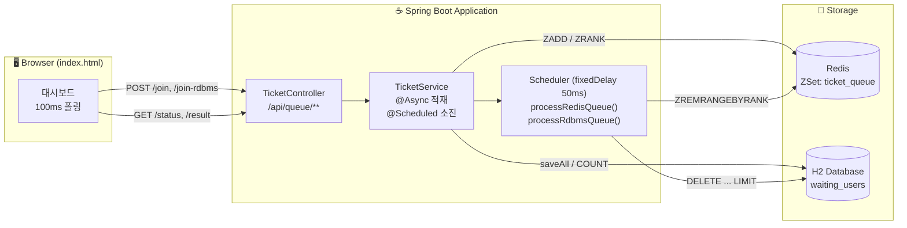
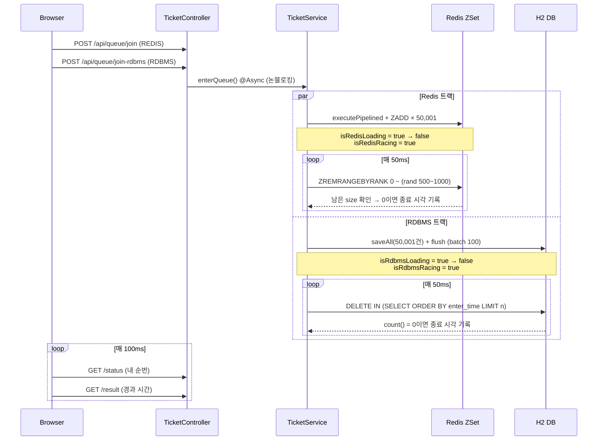
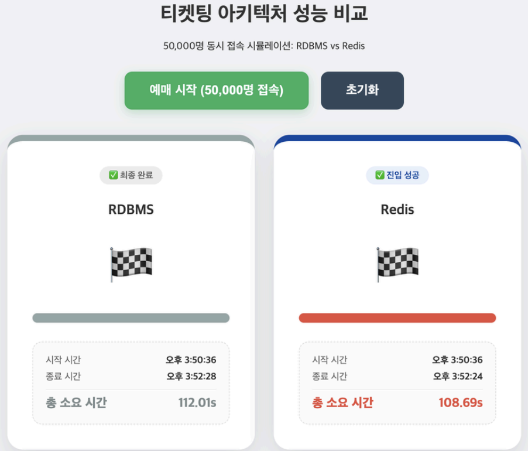
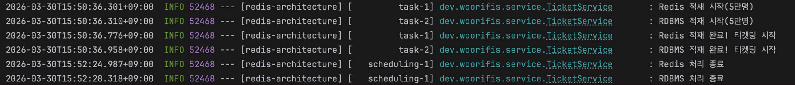

# 🎫 Redis 기반 DB 아키텍처 설계 및 RDBMS 비교 실습

> **[백엔드 세미나]** 5만 명 동시 접속 티켓팅 대기열 시뮬레이션
>
> 동일한 "대기열(Waiting Queue)" 요구사항을 **RDBMS(H2)** 와 **Redis(Sorted Set)** 두 가지 아키텍처로 각각 구현하고,
> 같은 조건에서 나란히 실행시켜 **처리 시간 차이를 눈으로 확인**하는 실습 프로젝트입니다.

---

## 📌 목차

- [발표 요약](#-발표-요약)
- [기획 배경](#-기획-배경)
- [무엇을 비교하는가](#-무엇을-비교하는가)
- [프로젝트 구조](#-프로젝트-구조)
- [시스템 아키텍처](#-시스템-아키텍처)
- [핵심 구현](#-핵심-구현)
- [실행 방법](#-실행-방법)
- [시뮬레이션 시나리오](#-시뮬레이션-시나리오)
- [실행 결과](#-실행-결과)
- [배운 점 / 트러블슈팅](#-배운-점--트러블슈팅)
- [한계 및 개선 방향](#-한계-및-개선-방향)

---

## 🗂 발표 요약

> 세미나 발표(`Redis를 활용한 DB 아키텍처 설계`) 슬라이드 내용을 정리한 개요입니다. 아래 실습은 이 발표에서 다룬 내용을 코드로 직접 구현하고 측정한 결과물입니다.

### 1. Redis가 필요한 이유

RDBMS로 대용량 데이터를 처리할 때 발생하는 문제:

- **디스크 I/O 병목(Disk I/O Bottleneck)**
- **인덱스 및 쿼리 연산 부하**
- **트랜잭션 잠금(Transaction Locking)**

이로 인해 **검색 속도 저하, 필터링 속도 저하, 배치 처리 지연**이 발생합니다.

### 2. Redis란 무엇인가

**Redis(REmote DIctionary Server)** 는 오픈 소스 기반의 **인메모리(In-Memory)** 데이터 저장소로, Key-Value 구조를 통해 다양한 비정형 데이터 타입을 지원하여 로직을 빠르게 처리하는 데이터베이스 관리 시스템입니다.

| 장점 | 단점 |
|---|---|
| 빠른 속도 | 높은 메모리 비용 |
| 다양한 자료 구조 지원 | 데이터 유실 위험 |
| 동시성 문제 방지 | 고비용 작업 시 성능 저하 |
| 영속성 지원 | |

**활용 사례**: 캐싱(Caching), Messaging & Queue, 실시간 리더보드

### 3. Redis 구조 및 동작 원리

- Redis는 하나의 **Key**에 대해 String, List, Hash, Set/Sorted Set 등 다양한 **Value** 자료구조를 매핑하는 In-Memory 구조입니다.
- 클라이언트 요청은 **Single Thread**로 순차 처리되며(GET, ZADD, INCR 등), In-Memory 저장소에서 즉시 응답을 반환합니다.

### 4. Redis & RDBMS 협업 전략

| 전략 | 동작 방식 | 장점 | 단점 |
|---|---|---|---|
| **A. Look Aside** | 조회 시 Cache를 먼저 탐색 → Cache Hit이면 바로 반환, Cache Miss면 RDBMS 조회 후 Redis에 저장 | 캐시에 있는 데이터는 빠르게 응답 | – |
| **B. Write Around** | 모든 데이터는 DB에 저장하고, 읽은 데이터만 Cache에 저장 (Cache Miss 시에만 캐싱) | Cache Engine 부하 감소, Cache Memory 절약 | DB-Cache 데이터 불일치, 초기 조회 시 지연 발생 |
| **C. Write Back** | 데이터를 DB에 즉시 저장하지 않고 Cache에 먼저 저장 후, 일정 시간 경과 후 RDBMS에 반영 | DB 사용 비용 절약 | 이동 전 Cache 장애 시 데이터 유실 |

### 5. 코드 시연 개요

- **상황**: 티켓 예매 시작 시 5만 명이 홈페이지에 동시 접속하고, "나"는 5만 1번째 접속자가 됨 → RDBMS/Redis 각각에서 내 순서가 올 때까지 걸리는 시간을 비교
- **시연 환경**
  - RDBMS: H2 Database, File Mode 저장, SSD에 직접 데이터 기록, `flush()`로 Disk I/O 병목 재현
  - Redis: Docker Container 인프라, In-Memory 저장, 로컬과 분리된 컨테이너 환경, Sorted Set 자료구조 활용
- **결과**: 동일한 로직이라도 RAM(In-Memory)과 SSD(Disk)라는 물리적 저장 매체의 읽기/쓰기 속도 차이로 처리 시간 격차 발생 (RDBMS 약 112.01s vs Redis 약 108.69s, 측정 환경에 따라 상이)

### 마무리

> 특정 DB에 의존하기보다, **저장 매체의 물리적 특성을 고려한 아키텍처 설계**가 중요합니다.

---

## 🎯 기획 배경

콘서트 예매, 수강 신청처럼 **짧은 순간에 트래픽이 몰리는 서비스**는 "누가 먼저 왔는가"를 관리하는 대기열이 필수입니다.

이때 대기열을 **RDBMS 테이블로 구현하면** 다음과 같은 문제가 생깁니다.

| 동작 | RDBMS 구현 | 비용 |
|---|---|---|
| 줄 세우기 | 5만 건 `INSERT` | 디스크 I/O + 트랜잭션 로그 |
| 내 순번 조회 | `SELECT COUNT(*) WHERE enter_time < ?` | 매 조회마다 **전체 스캔** |
| 앞사람 입장 처리 | `DELETE ... ORDER BY enter_time LIMIT n` | **정렬 후 삭제** + 락 경합 |

반면 Redis의 **Sorted Set(ZSet)** 은 "점수(score) 순으로 정렬된 집합"이라는 자료구조 자체가 대기열과 정확히 일치합니다.
이 프로젝트는 **자료구조의 선택이 곧 아키텍처의 성능**이라는 점을 실측으로 증명하는 것을 목표로 합니다.

---

## 🔍 무엇을 비교하는가

두 방식은 **완전히 동일한 시나리오**를 수행합니다.

1. 더미 유저 50,000명 + 실제 유저 1명을 대기열에 적재
2. 50ms마다 **500~1,000명씩 랜덤하게** 대기열에서 제거(= 입장 처리)
3. 대기열이 완전히 비워질 때까지 반복
4. 시작/종료 타임스탬프를 기록해 총 소요 시간 비교

### 자료구조 관점 비교

| 항목 | RDBMS (H2 + JPA) | Redis (Sorted Set) |
|---|---|---|
| 저장 위치 | 디스크 (파일 기반 H2) | 메모리 (In-Memory) |
| 대기열 표현 | `waiting_users` 테이블 + `enter_time` 컬럼 | `ticket_queue` ZSet + score(timestamp) |
| 줄 세우기 | `saveAll()` → 5만 건 INSERT (batch 100) | `ZADD` 파이프라인 일괄 전송 |
| 순번 조회 | `COUNT(*) WHERE enter_time < ?` → **O(N)** | `ZRANK` → **O(log N)** |
| 앞에서 N명 제거 | `DELETE IN (SELECT ... ORDER BY ... LIMIT n)` → **O(N log N)** | `ZREMRANGEBYRANK` → **O(log N + M)** |
| 트랜잭션 | 매 사이클마다 트랜잭션 커밋 | 단일 스레드 원자적 명령 |
| 정렬 유지 비용 | 쿼리 시점마다 정렬 수행 | **삽입 시점에 이미 정렬 완료** |

> 핵심은 단순히 "메모리 vs 디스크"가 아닙니다.
> **RDBMS는 순서를 매번 계산해야 하고, Redis는 순서를 이미 알고 있다**는 점이 성능 격차의 본질입니다.

---

## 📁 프로젝트 구조

```
redis-architecture/
├── build.gradle                     # Spring Boot 4.0.5 / Java 17 / Gradle 9.4.1
├── src/main/
│   ├── java/dev/woorifis/
│   │   ├── RedisArchitectureApplication.java   # @EnableAsync, @EnableScheduling
│   │   ├── controller/
│   │   │   └── TicketController.java           # /api/queue/** REST API
│   │   ├── service/
│   │   │   └── TicketService.java              # 적재·소진·순번조회 핵심 로직
│   │   ├── domain/
│   │   │   └── Ticket.java                     # (확장용) 좌석 재고 엔티티
│   │   ├── entity/
│   │   │   └── WaitingUser.java                # RDBMS 대기열 엔티티
│   │   └── repository/
│   │       ├── TicketRepository.java
│   │       └── WaitingUserRepository.java      # deleteTopN() native query
│   └── resources/
│       ├── application.yaml                    # H2 파일 DB + JPA 배치 설정
│       └── static/
│           └── index.html                      # 실시간 비교 대시보드
└── data/                                       # H2 파일 (gitignore 대상)
```

---

## 🏗 시스템 아키텍처



### 처리 흐름



---

## 💡 핵심 구현

### 1. 대기열 적재 — `TicketService.enterQueue()`

두 방식 모두 `@Async`로 실행되어 HTTP 응답을 막지 않습니다.

**Redis: 파이프라인 + ZADD**

```java
redisTemplate.executePipelined((RedisCallback<Object>) connection -> {
    byte[] key = QUEUE_KEY.getBytes();
    for (int i = 1; i <= total; i++) {
        connection.zAdd(key, (double) now + i, ("dummy_" + i).getBytes());
    }
    connection.zAdd(key, (double) now + total + 1, userId.getBytes());
    return null;
});
```

- **파이프라이닝**으로 5만 번의 명령을 왕복(RTT) 없이 한 번에 전송
- `score`에 진입 시각(ms)을 넣어 **삽입과 동시에 정렬** 완료

**RDBMS: 배치 INSERT**

```java
transactionTemplate.execute(status -> {
    List<WaitingUser> dummies = new ArrayList<>();
    for (int i = 1; i <= total; i++) {
        dummies.add(new WaitingUser("dummy_" + i, now + i));
    }
    dummies.add(new WaitingUser(userId, now + total + 1));

    waitingUserRepository.saveAll(dummies);
    waitingUserRepository.flush();
    return null;
});
```

- `jdbc.batch_size: 100`, `order_inserts: true`로 **JPA 배치 최적화를 적용한 상태**에서 비교
  → "JPA를 못 써서 느린 것"이 아니라 **구조적 차이**임을 보이기 위함

### 2. 대기열 소진 — `@Scheduled(fixedDelay = 50)`

두 스케줄러가 각각 50ms 주기로 동작하며, 매 사이클 **500~1,000명을 랜덤하게** 입장시킵니다.

```java
// Redis: 정렬된 집합의 앞부분을 통째로 잘라냄 → O(log N + M)
int count = ThreadLocalRandom.current().nextInt(500, 1001);
redisTemplate.opsForZSet().removeRange(QUEUE_KEY, 0, count - 1);
```

```java
// RDBMS: 매번 정렬 → 상위 N개 선별 → 삭제 (native query)
@Modifying
@Query(value = "DELETE FROM waiting_users WHERE id IN " +
               "(SELECT id FROM waiting_users ORDER BY enter_time ASC LIMIT :limit)",
       nativeQuery = true)
void deleteTopN(@Param("limit") int limit);
```

> JPQL로는 서브쿼리 `LIMIT`을 표현할 수 없어 **native query**로 작성했습니다.
> 이 한 줄이 매 사이클마다 정렬 비용을 다시 지불하는 지점이며, RDBMS 병목의 핵심입니다.

### 3. 내 순번 조회 — `getWaitCount()`

```java
if ("REDIS".equals(mode)) {
    if (isRedisLoading.get()) return 50000L;
    return redisTemplate.opsForZSet().rank(QUEUE_KEY, userId);   // O(log N)
}

if (isRdbmsLoading.get()) return 50000L;
WaitingUser me = waitingUserRepository.findByUserId(userId);
if (me == null) return null;
return waitingUserRepository.countByEnterTimeBefore(me.getEnterTime());  // O(N) 스캔
```

- Redis는 **`ZRANK` 한 번**이면 순번이 나옵니다.
- RDBMS는 나를 찾고(`findByUserId`) → 나보다 먼저 온 사람을 **전부 세어야**(`COUNT`) 합니다.
  이 조회가 100ms마다 반복되면서 삭제 작업과 락을 경합합니다.

### 4. 상태 플래그 설계

```java
private final AtomicBoolean isRedisRacing  = new AtomicBoolean(false);  // 소진 진행 중
private final AtomicBoolean isRedisLoading = new AtomicBoolean(false);  // 적재 진행 중
```

- `isLoading`이 필요한 이유: **적재 도중에는 내 데이터가 아직 없어** `ZRANK`/`COUNT`가 `null` 또는 `0`을 반환합니다.
  이를 그대로 두면 화면이 "진입 성공 🏁"으로 **조기 종료**되므로, 적재 중에는 `50000`을 고정 반환하도록 방어했습니다.
- 스케줄러 스레드와 웹 요청 스레드가 동시에 접근하므로 `AtomicBoolean`으로 가시성을 확보했습니다.

---

## 🚀 실행 방법

### 1. 사전 준비 — Redis 실행

```bash
# Docker
docker run -d --name redis-ticketing -p 6379:6379 redis:7-alpine

# 또는 macOS (Homebrew)
brew install redis && brew services start redis
```

> 접속 정보를 명시하지 않으면 Spring Data Redis 기본값인 `localhost:6379`로 연결됩니다.
> 다른 호스트/포트를 쓴다면 `application.yaml`에 아래를 추가하세요.
>
> ```yaml
> spring:
>   data:
>     redis:
>       host: localhost
>       port: 6379
> ```

### 2. 애플리케이션 실행

```bash
./gradlew bootRun
```

빌드 후 실행하려면:

```bash
./gradlew clean build
java -jar build/libs/redis-architecture-0.0.1-SNAPSHOT.jar
```

### 3. 접속

| 주소 | 설명 |
|---|---|
| http://localhost:8080 | 시뮬레이션 대시보드 |
| http://localhost:8080/h2-console | H2 콘솔 (JDBC URL: `jdbc:h2:file:./data/ticketing`, User: `sa`, PW: 없음) |

> H2는 파일 모드(`./data/ticketing.mv.db`)로 동작하며, `ddl-auto: create` 설정으로 **재시작 시 테이블이 초기화**됩니다.

---

## 🎬 시뮬레이션 시나리오

1. 브라우저에서 **「예매 시작 (50,000명 접속)」** 클릭
2. Redis / RDBMS 양쪽에 동시에 적재 요청이 나가고, 두 패널이 나란히 카운트다운 시작
3. 화면 구성
   - **큰 숫자**: 내 앞에 남은 대기 인원 (실시간)
   - **프로그레스 바**: 소진 진행률
   - **시작 / 종료 시간 · 총 소요 시간**: 서버가 기록한 타임스탬프 기반
4. 먼저 `🏁`가 뜨는 쪽이 승리 — 대부분 **Redis 패널이 먼저 종료**됩니다
5. **「초기화」** 버튼으로 Redis 키와 테이블을 비우고 재실행 가능

---

## 📊 실행 결과

50,000명 동시 접속 시뮬레이션 기준, 대시보드에서 확인한 실제 측정 결과입니다.



| 구분 | RDBMS (H2) | Redis (ZSet) | 차이 |
|---|---|---|---|
| 시작 시간 | 오후 3:50:36 | 오후 3:50:36 | 동일 |
| 종료 시간 | 오후 3:52:28 | 오후 3:52:24 | – |
| 총 소요 시간 | 112.01s | 108.69s | 약 1.03배 |

**애플리케이션 로그**

애플리케이션 로그에서도 적재 시작 → 적재 완료(티켓팅 시작) → 처리 종료의 3단계를 각각 확인할 수 있습니다.



**측정 방법**
- 소요 시간은 서버의 `System.currentTimeMillis()` 기준으로 기록되며 `GET /api/queue/result`로 조회합니다.

**관찰 포인트**
- RDBMS는 **적재 단계**에서부터 이미 벌어지기 시작합니다 (트랜잭션 + 디스크 쓰기). 로그 상으로도 Redis 적재 완료(15:50:36.776)가 RDBMS 적재 완료(15:50:36.958)보다 먼저 끝났습니다.
- 소진 단계에서 격차가 더 커집니다. Redis는 삭제 대상이 이미 정렬되어 있지만, RDBMS는 **매 사이클 5만 → 4만 → 3만 건을 다시 정렬**합니다. 실제로 Redis 처리 종료(15:52:24.987)가 RDBMS 처리 종료(15:52:28.318)보다 약 3.3초 앞섰습니다.
- 대기 인원이 줄어들수록 RDBMS도 빨라집니다 → 정렬 비용이 데이터 양에 비례한다는 증거.

---

## 🧠 배운 점 / 트러블슈팅

### 1. "적재 중 조기 완료" 버그
적재가 끝나기 전에 `/status`를 호출하면 `ZRANK`가 `null`을 반환해 화면이 즉시 "진입 성공"으로 바뀌는 문제가 있었습니다.
→ `isLoading` 플래그를 두고 적재 중에는 `50000`을 반환하도록 처리.

### 2. `@Async`가 없으면 화면이 멈춘다
5만 건 적재는 수 초가 걸리므로 동기 처리 시 HTTP 응답이 늦어져 **비교 자체가 불가능**했습니다.
→ `@EnableAsync` + `@Async`로 적재를 백그라운드로 분리하고, 클라이언트는 폴링으로 상태만 확인.

### 3. JPQL로는 `DELETE ... LIMIT`을 못 쓴다
JPA 표준 JPQL은 서브쿼리 내 `LIMIT`을 지원하지 않아 `nativeQuery = true`로 우회했습니다.
→ **DB 종속적인 쿼리가 생긴다는 것 자체가 RDBMS 대기열 구현의 비용**임을 체감.

### 4. 공정한 비교를 위한 조건 통일
- 배치 크기(`jdbc.batch_size: 100`), `order_inserts`를 켜서 RDBMS에 **불리한 조건을 제거**
- 두 스케줄러 모두 동일한 주기(50ms)와 동일한 랜덤 범위(500~1,000)를 사용
- 그럼에도 격차가 발생한다면, 그것은 **튜닝이 아니라 자료구조의 문제**

### 5. 스레드 안전성
`@Scheduled` 스레드와 웹 요청 스레드가 같은 상태를 공유하므로, 플래그는 `AtomicBoolean`으로 관리했습니다.

---

## ⚠️ 한계 및 개선 방향

이 프로젝트는 **세미나 실습용 시뮬레이션**이며, 실제 프로덕션과는 다음 차이가 있습니다.

| 한계 | 설명 | 개선 방향 |
|---|---|---|
| 단일 프로세스 시뮬레이션 | 실제 5만 개의 HTTP 커넥션이 아니라 서버 내부 루프로 부하를 생성 | k6 / nGrinder / JMeter로 실제 동시 요청 발생 |
| H2 사용 | 임베디드 DB라 MySQL·PostgreSQL과 튜닝 특성이 다름 | MySQL(InnoDB) + 인덱스 유무 비교 실험 |
| 인덱스 미적용 | `enter_time`에 인덱스가 없어 `COUNT`/`ORDER BY`가 풀스캔 | 인덱스 추가 후 재측정하여 **"인덱스로 얼마나 따라잡히는가"** 확인 |
| 타임스탬프 필드가 비원자적 | `redisStartTime` 등이 일반 `long` 필드 | `volatile` 또는 `AtomicLong`으로 가시성 보장 |
| Redis 단일 노드 | 장애 시 대기열 전체 유실 | Redis Sentinel / Cluster, AOF·RDB 영속화 검토 |
| 중복 진입 미처리 | 같은 `userId`로 여러 번 진입 가능 | ZSet 특성(중복 member 불가) 활용 + 멱등 처리 |
| 미사용 코드 | `Ticket` / `TicketRepository`는 좌석 재고 확장용으로 남겨둔 스켈레톤 | 재고 차감 로직(`DECR` vs `SELECT FOR UPDATE`) 비교로 확장 |
